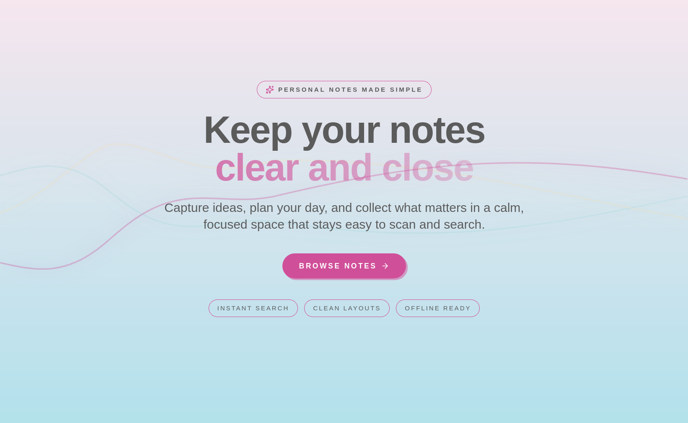
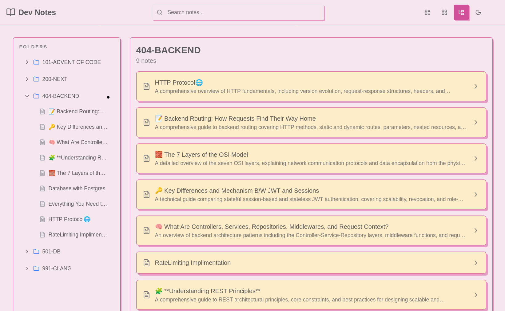

# Dev Notes - Personal Notes Dashboard

A modern, feature-rich notes dashboard built with Vite, React, TypeScript, and shadcn/ui with the mrrobot-bubble theme.
## Images

<div align="center">




## Features

- **Markdown Support**: Full GitHub Flavored Markdown with syntax highlighting
- **Multiple Views**: Switch between List, Grid, and Tree views
- **Search**: Real-time search across note titles, content, tags, and folders
- **Organized Structure**: Folder-based organization with folder navigation
- **Read-Only**: Browse and search through your notes securely
- **Static Build**: Fast, static-generated site perfect for Cloudflare Pages
- **Beautiful Theme**: Custom "mrrobot-bubble" theme with playful shadows and modern design

## Tech Stack

- **Frontend**: React 19 + TypeScript
- **Build Tool**: Vite
- **UI Library**: shadcn/ui (mrrobot-bubble theme)
- **Styling**: Tailwind CSS + @tailwindcss/typography
- **Routing**: React Router
- **Markdown**: react-markdown + remark-gfm + react-syntax-highlighter
- **Package Manager**: Bun

## Project Structure

```
notes-app/
├── notes/                      # Your markdown notes
│   ├── 000-INDEX/
│   ├── 101-FRONTEND/
│   ├── 102-BACKEND/
│   └── 103-DEVOPS/
├── scripts/
│   └── build-notes-index.ts    # Generates notes index at build time
├── src/
│   ├── components/
│   │   ├── ui/                 # shadcn components
│   │   ├── layout/             # Header, navigation
│   │   ├── dashboard/          # List, Grid, Tree views
│   │   ├── note/               # Note viewer, markdown renderer
│   │   └── search/             # Search functionality
│   ├── hooks/                  # Custom React hooks
│   ├── pages/                  # Route pages
│   ├── types/                  # TypeScript definitions
│   └── lib/                    # Utilities
└── public/
    ├── notes-index.json        # Generated notes index
    └── _redirects              # Cloudflare Pages SPA routing
```

## Getting Started

### Prerequisites

- [Bun](https://bun.sh/) installed
- Node.js 18+ (for compatibility)

### Installation

```bash
# Install dependencies
bun install

# Generate notes index and start dev server
bun run dev
```

### Development

```bash
# Start dev server
bun run dev

# Build for production
bun run build

# Preview production build
bun run preview
```

## Adding Notes

1. Create markdown files in the `notes/` directory
2. Organize them into folders (e.g., `notes/FOLDER-NAME/note.md`)
3. Optionally add frontmatter:

```markdown
---
title: "My Note Title"
date: "2024-02-02"
tags: ["tag1", "tag2"]
category: "Category Name"
---

# Your Note Content

Write your notes in markdown...
```

4. Rebuild the app - the build script will automatically index all notes

## Deployment

### Cloudflare Pages

1. Push your code to GitHub
2. Connect your repository to Cloudflare Pages
3. Set build settings:
   - **Build command**: `bun run build`
   - **Build output directory**: `dist`
4. Deploy!

The `_redirects` file is already configured for SPA routing.

### Other Platforms

The app works on any static hosting platform:
- Vercel
- Netlify
- GitHub Pages
- AWS S3 + CloudFront

## Customization

### Theme

The app uses the "mrrobot-bubble" theme. To customize colors, edit `src/index.css`.

### Views

You can customize the dashboard views in `src/components/dashboard/`.

### Folder Structure

The app reads folder names as-is (e.g., "404-BACKEND" displays as "404-BACKEND"). Update the note processing logic in `scripts/build-notes-index.ts` if you want to transform folder names.

## Features Explained

### Search

The search function works across:
- Note titles
- Note content
- Tags
- Folder names

Results update in real-time as you type.

### View Modes

- **List View**: Vertical list with full metadata
- **Grid View**: Card-based grid layout
- **Tree View**: Folder sidebar + note list

Your view preference is saved in localStorage.

### Markdown Rendering

Supports:
- GitHub Flavored Markdown
- Syntax highlighting (100+ languages)
- Tables
- Task lists
- Footnotes
- Auto-linking

## Performance

- **Static Build**: All notes indexed at build time
- **Fast Loading**: Minimal runtime processing
- **Code Splitting**: Lazy load routes
- **Optimized Bundle**: ~368 KB gzipped

## License

MIT

## Contributing

This is a personal project, but feel free to fork and customize for your own use!

## Acknowledgments

- [shadcn/ui](https://ui.shadcn.com/) for the component library
- [Tripled UI](https://ui.tripled.work/) for the mrrobot-bubble theme
- [Vite](https://vitejs.dev/) for the blazing-fast build tool
